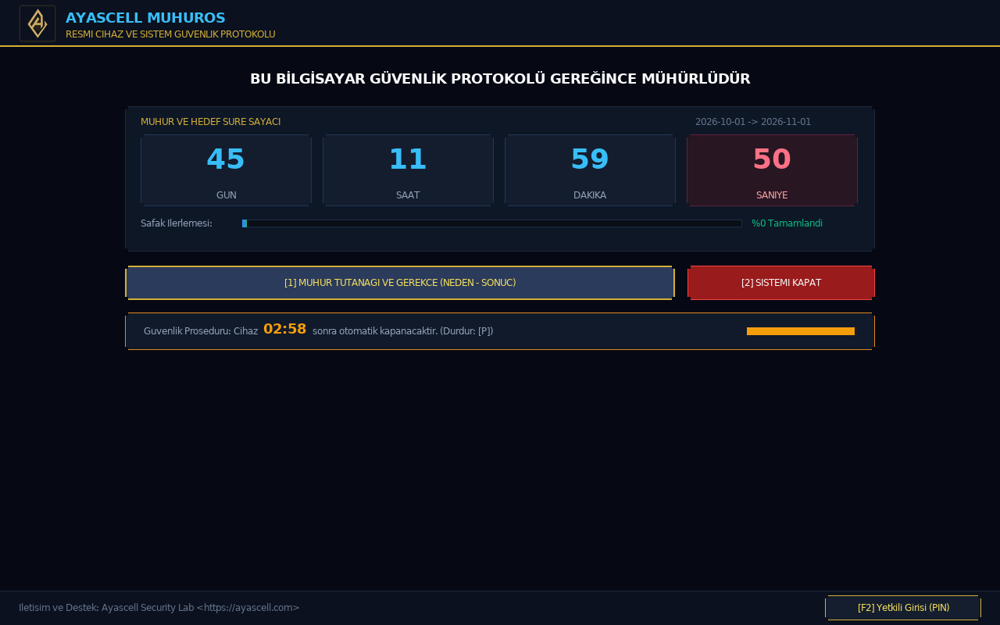
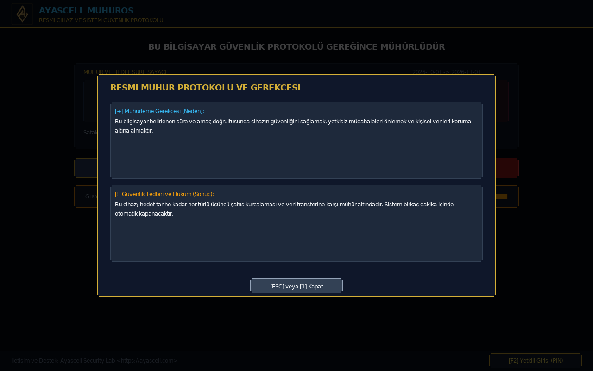
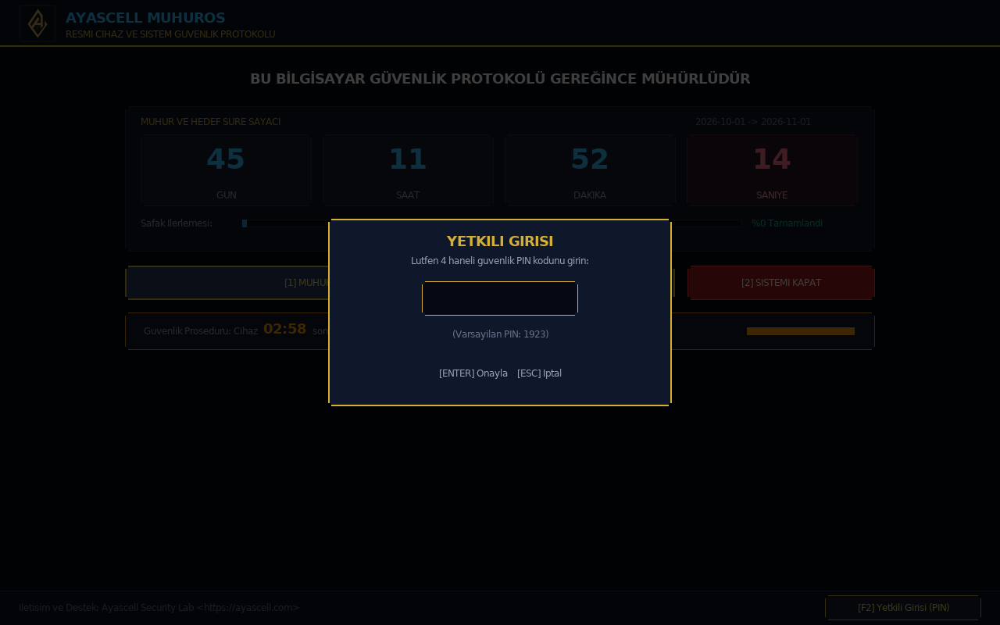

# 🎖️ Ayascell MuhurOS - Donanım Mühürleme ve Kiosk İşletim Sistemi

[](LICENSE)
[]()
[]()
[]()
[]()

Cihaz ve veri güvenliğini sağlamak, yetkisiz üçüncü şahıs kurcalamalarını engellemek, vatani görev, odaklanma karantinası veya tatil süreçlerinde bilgisayar açıldığında **tam ekran mühür kaşesi, resmi tutanak ve canlı hedef süre sayacı** sunan; şifre korumalı yönetim paneli barındıran ve **1-2 saniyede doğrudan açılan** bağımsız mikro işletim sistemi (**~19 MB**).

---

## 📸 Ekran Görüntüleri

### 1. Ana Mühür Kiosk Ekranı (1280x800 Framebuffer)


### 2. [1] Resmi Mühür Tutanağı ve Hüküm Modalı


### 3. [F2] 1923 PIN Korumalı Yönetici ve Canlı Düzenleme Paneli


---

## 🌟 Neden Ayascell MuhurOS?

| Özellik | Geleneksel mkarchiso / Ubuntu ISO | Ayascell MuhurOS |
| :--- | :---: | :---: |
| **Çekirdek Altyapısı** | Şişirilmiş Ağır Dağıtım Çekirdeği | **Resmi Arch Linux LTS Çekirdeği (Optimize & Minimalist)** |
| **Toplam Boyut** | ~1.8 GB - 2.5 GB (Ağır) | **Sadece ~19 MB (100 kat daha hafif!)** |
| **Açılış Hızı** | 30 - 60 saniye (systemd, X11, Display Manager) | **1 - 2 saniye (Anında Framebuffer)** |
| **Donanım Kapatma** | Ağır servislerin kapanması beklenir | **ACPI S5 (`reboot: Power down`) ile %100 temiz donanımsal güç kesme** |
| **Dell G15 / Modern EC Uyumu** | Saf UEFI reset döngüye girer | **Linux ACPI AML (`\_PTS(5)`) işletilir; EC kapanır** |
| **Taşınabilirlik** | Format atar, disk bölümlerini riske atabilir | **Format atmaz, USB veya EFI'ye atıldığı gibi çalışır** |
| **Yapılandırma** | Kod derleme / ISO yeniden üretme | **`config.txt` dosyasını Not Defteri ile aç & düzenle** |

---

## ⚡ Hızlı Başlangıç & Kurulum Seçenekleri

> 🚀 **Derleme Yapmanıza Gerek Yoktur!**  
> MuhurOS; `dist/` klasöründe derlenmiş, test edilmiş ve donanım sürücüleri entegre edilmiş olarak kullanıma hazır **(~19 MB)** gelir. Repoyu indirdiğiniz anda kod derlemekle uğraşmadan aşağıdaki tek-tık araçlarla doğrudan kullanabilirsiniz. *(C kaynak kodlarında değişiklik yaptıysanız `./build.sh` ile 5 saniyede sıfırdan derleyebilirsiniz).*

---

### 🪟 Windows Kullanıcıları İçin (Tek Tıkla Kurulum)

Windows yüklü bilgisayarlarda hiçbir komut veya derleyiciye ihtiyaç duymadan hazır `.bat` betikleriyle tek tıkla işlem yapabilirsiniz:

1. **USB Belleğe Yazma (Format Gerekmez):**
   - `windows_usb_kopyala.bat` dosyasına çift tıklayın ➔ USB sürücü harfinizi (Örn: `E` veya `F`) yazın. Saniyeler içinde hazır!
2. **Doğrudan Windows Bilgisayara Kurma (Mevcut EFI):**
   - `windows_kurulum.bat` dosyasına **Sağ Tıklayıp "Yönetici olarak çalıştır"** deyin.
   - Windows EFI Sistem Bölümüne `EFI\AyascellMuhur` eklenir ve Windows Boot Manager / UEFI menüsüne kaydedilir.
   - Bilgisayar açılırken **F12 / F11 / F8** tuşuyla "Ayascell MuhurOS" seçilebilir. Windows dosyalarınıza veya masaüstünüze kesinlikle dokunmaz.
3. **Windows'tan Kaldırma:**
   - `windows_kaldir.bat` dosyasına **Sağ Tıklayıp "Yönetici olarak çalıştır"** demeniz yeterlidir. Tek saniyede temizler.

---

### 🐧 Linux Kullanıcıları İçin

Terminalden dilediğiniz kurulum yöntemini tek komutla çalıştırabilirsiniz:

1. **USB Belleğe Yazma (Tak-Çalıştır):**
   ```bash
   sudo ./copy_to_usb.sh /dev/sdX1   # (Kendi USB bölümünüz, Örn: /dev/sdb1)
   ```
   *Format atmaz, USB'deki dosyalarınızı silmez. İstediğiniz PC'ye takıp F12 ile boot edebilirsiniz.*

2. **Bilgisayarın Mevcut EFI Bölümüne Kurma (Misafir Mod):**
   ```bash
   sudo ./install_to_pc.sh
   ```
   *Mevcut `/boot/efi` içine ekler. Mevcut Windows veya Linux önyükleyicilerine dokunmaz.*

3. **Bağımsız 50 MB Mühür Bölümüne Kurma (Ölümsüz / Çift ESP Modu):**
   *Bu yöntem ana sisteminizin `BOOTX64.EFI` veya EFI dosyalarına asla dokunmaz. Kendi bağımsız bölümünde yaşar ve **BIOS sıfırlansa dahi anakart tarafından otomatik olarak tanınır.***
   
   <details>
   <summary><b>👉 50 MB Alan Nasıl Açılır? (GParted & Windows Adımları)</b></summary>

   * **GParted ile (Linux):**
     1. Herhangi bir diskinize sağ tıklayıp **Boyutlandır/Taşı** deyin.
     2. **"Ardındaki boş alan (MiB)"** kutusuna `50` (veya `100`) yazıp **Boyutlandır**'a basın.
     3. Oluşan gri *"Ayrılmamış"* alana sağ tıklayıp **Yeni** deyin:
        - **Dosya Sistemi:** `fat32`
        - **Etiket (Label):** `MUHUROS`
        - **+ Ekle** butonuna basın.
     4. Üstteki yeşil onay butonuna (**✔ Tüm İşlemleri Uygula**) basın.
   * **Windows ile (Disk Yönetimi):**
     1. `diskmgmt.msc` açın ➔ C sürücüsüne sağ tık **Birimi Küçült** ➔ `50` MB yazın.
     2. Oluşan alana sağ tık **Yeni Basit Birim** ➔ Formatı `FAT32`, etiketini `MUHUROS` yapın.
   </details>

   ```bash
   # Açtığınız 50 MB'lık bölümün adıyla kurun (Örnek: /dev/sda3 veya /dev/nvme0n1p4):
   sudo ./install_to_partition.sh /dev/BÖLÜM_ADINIZ
   ```

4. **Sanal Makinede Anında Test Etme (QEMU):**
   ```bash
   ./test_qemu.sh
   ```

5. **Bilgisayardan Temiz Kaldırma:**
   ```bash
   sudo ./uninstall_from_pc.sh
   ```

6. **Geliştiriciler İçin Sıfırdan Yeniden Derleme (Opsiyonel):**
   ```bash
   ./build.sh
   ```

---

## 🎮 Klavye Kontrolleri

- **`[1]` Mühür Tutanağı:** Resmi protokol metnini, mühürlenme gerekçesini (Neden - Sonuç) tam ekran açar ve kapatır.
- **`[2]` Sistemi Güvenli Kapat (Acil):** Sayaç bitmesini beklemeden donanım gücünü ACPI S5 seviyesinde anında keser.
- **`[P]` Sayacı Duraklat:** Otomatik kapanış sayacını duraklatır veya devam ettirir.
- **`[F2]` Yetkili Girişi (Varsayılan PIN: `1923`):** 
  - Yönetici PIN doğrulamasının ardından canlı düzenleme ekranını açar.
  - `[↑] / [↓]`: Hedef Yıl, Ay, Gün veya Kapanma Sayacı alanını seçer.
  - `[←] / [→]`: Tarih veya süreyi artırıp azaltır.
  - `[ENTER]`: Değişiklikleri `config.txt` dosyasına kalıcı olarak kaydeder.
  - `[ESC]`: Açık modalları kapatır.

---

## 📝 Not Defteri ile Kolay Yapılandırma (`config.txt`)

USB kök dizinindeki veya EFI bölümündeki `config.txt` dosyasını Windows / Mac / Linux ortamında herhangi bir metin düzenleyiciyle açarak sistemi özelleştirebilirsiniz:

```ini
# =========================================================
#   Ayascell MuhurOS Kiosk Yapilandirma Dosyasi
# =========================================================

sahip = Ayascell
baslik = BU BILGISAYAR GUVENLIK PROTOKOLU GEREGINCE MUHURLUDUR

# --- HEDEF MUHUR TARIHI ---
hedef_yil = 2026
hedef_ay = 11
hedef_gun = 1

# --- SISTEM VE GUVENLIK AYARLARI ---
# Acilis ekraninda otomatik kapanis suresi (saniye, varsayilan: 180 sn = 3 dk)
kapanma_suresi = 180

# Yonetici ekrani acis PIN kodu (F2 tusu ile acilir)
pin = 1923

# --- MUHUR TUTANAGI METINLERI ---
tutanak_baslik = AYASCELL SISTEM GUVENLIK VE MUHUR PROTOKOLU TUTANAGI
gerekce = Bilgisayar sahibi Ayascell'in belirledigi sure ve amac dogrultusunda cihazin guvenligini saglamak, yetkisiz mudahaleleri onlemek ve kisisel verileri koruma altina almaktir.
sonuc = Bu cihaz; hedef tarihe kadar her turlu ucuncu sahis kurcalamasi ve veri transferine karsi muhur altindadir. Sistem birkac dakika icinde otomatik kapanacaktir.
```

---

## 📂 Proje Dizin Yapısı

```
MuhurOS/
├── src/                        # MuhurOS C kaynak kodları ve grafik motoru
│   ├── main.c                  # /init giriş noktası, RTC sayacı ve ACPI S5 kapanış
│   ├── fb_graphics.c/.h        # /dev/fb0 doğrudan Framebuffer, double-buffer & font motoru
│   ├── ui.c/.h                 # Mühür arayüzü, sayaç kutuları, tutanak ve PIN modalları
│   ├── config.c/.h             # config.txt ayrıştırıcı ve canlı kaydedici
│   ├── fonts_atlas.h           # Dejavu Sans orantılı ve anti-aliased font atlası
│   └── logo_data.h             # Ayascell resmi mühür logosu (RGBA ham piksel verisi)
├── dist/                       # Kullanıma hazır ~19 MB MuhurOS (vmlinuz, initramfs, config.txt)
├── build.sh                    # Statik C binary ve mikro initramfs derleyici
├── test_qemu.sh                # UEFI OVMF ile anında sanal makine testi
├── copy_to_usb.sh              # USB belleğe yazma aracı (Linux)
├── install_to_pc.sh            # Bilgisayarın mevcut EFI'sine kurma aracı (Linux)
├── install_to_partition.sh     # Bağımsız 50 MB mühür bölümüne kurma aracı (Linux)
├── uninstall_from_pc.sh        # Linux kaldırma aracı
├── windows_kurulum.bat         # Windows EFI kurulum sihirbazı (Tek tık)
├── windows_kaldir.bat          # Windows kaldırma aracı
├── windows_usb_kopyala.bat     # Windows USB hazırlama aracı
├── config.txt                  # Örnek yapılandırma dosyası
├── docs/
│   └── screenshots/            # GitHub ekran görüntüleri
├── KOMUTLAR.md                 # Hızlı komut referansı (Linux & Windows)
├── LICENSE                     # Ayascell Non-Commercial Özel Lisansı
└── README.md                   # Proje tanıtım belgesi
```

---

## 📄 Lisans ve Çekirdek Bildirimi

### 1. Ayascell MuhurOS Yazılımı
Bu proje **[Ayascell Non-Commercial Public License (ANCPL v1.0)](LICENSE)** altında lisanslanmıştır.
- ✅ **Kişisel, eğitim ve bireysel güvenlik amaçlı kullanım, inceleme ve derleme serbesttir.**
- ❌ **Her türlü doğrudan veya dolaylı ticari kullanım, kâr amaçlı satış ve cihazla paketleme KESİNLİKLE YASAKTIR.**
© 2026 Ayascell Security Lab. Tüm hakları saklıdır.

### 2. Arch Linux Çekirdeği (Linux Kernel)
- MuhurOS; Dell G15 5530 ve tüm modern x86_64 bilgisayarlarda en yüksek donanım uyumluluğu, ACPI S5 donanım güç yönetimi ve kararlılık için **resmi Arch Linux LTS çekirdeğini** (`linux-lts` / `vmlinuz`) ve gerekli mikro depolama sürücülerini (`vfat`, `nvme`, `usb-storage`) kullanır.
- Linux çekirdeği, Linus Torvalds ve küresel Linux topluluğu tarafından **GNU General Public License v2 (GPL-2.0)** altında lisanslanmıştır. Kullanıcı alanı (userspace) MuhurOS C uygulamaları bağımsız sistem çağrıları (syscall) ile çalışır.
